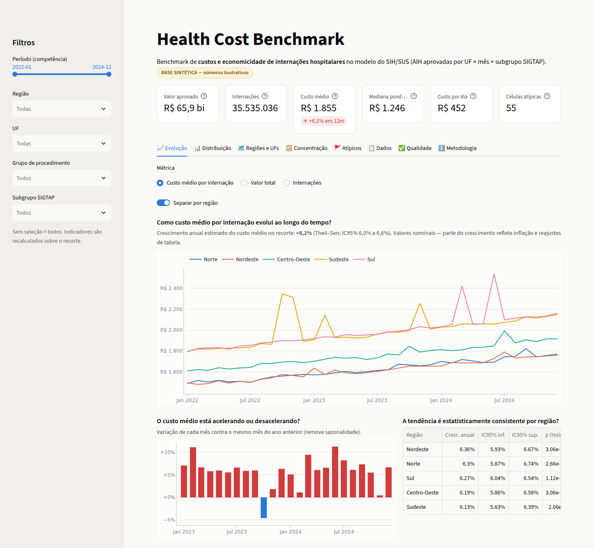
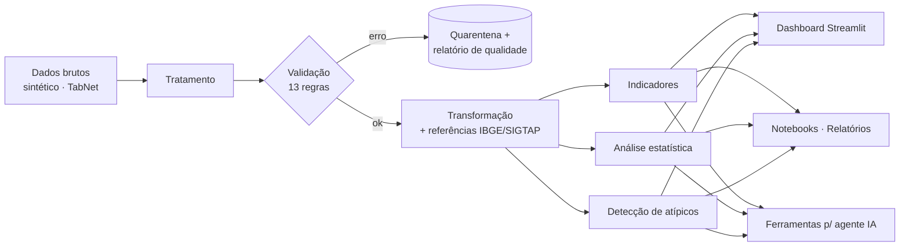
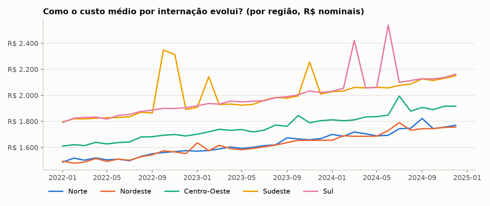
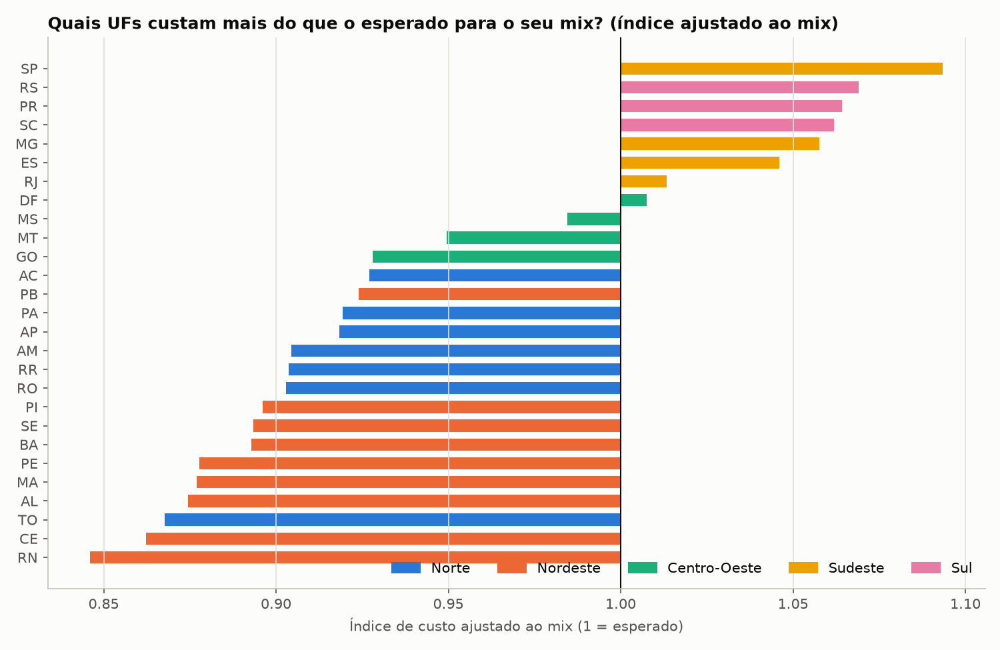
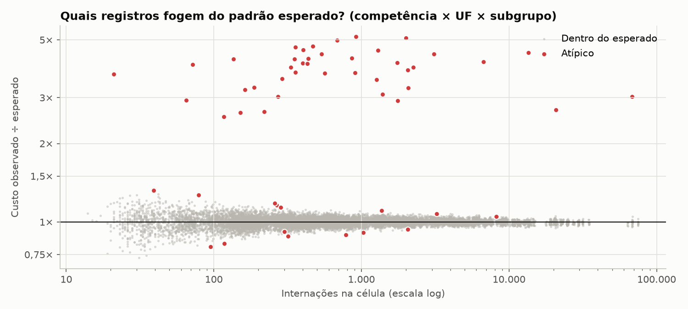
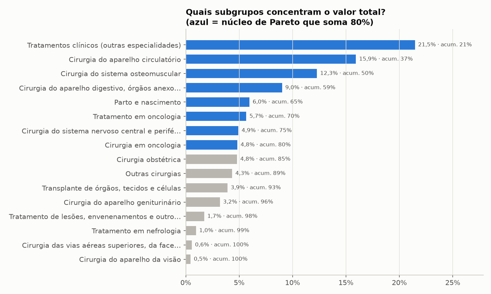
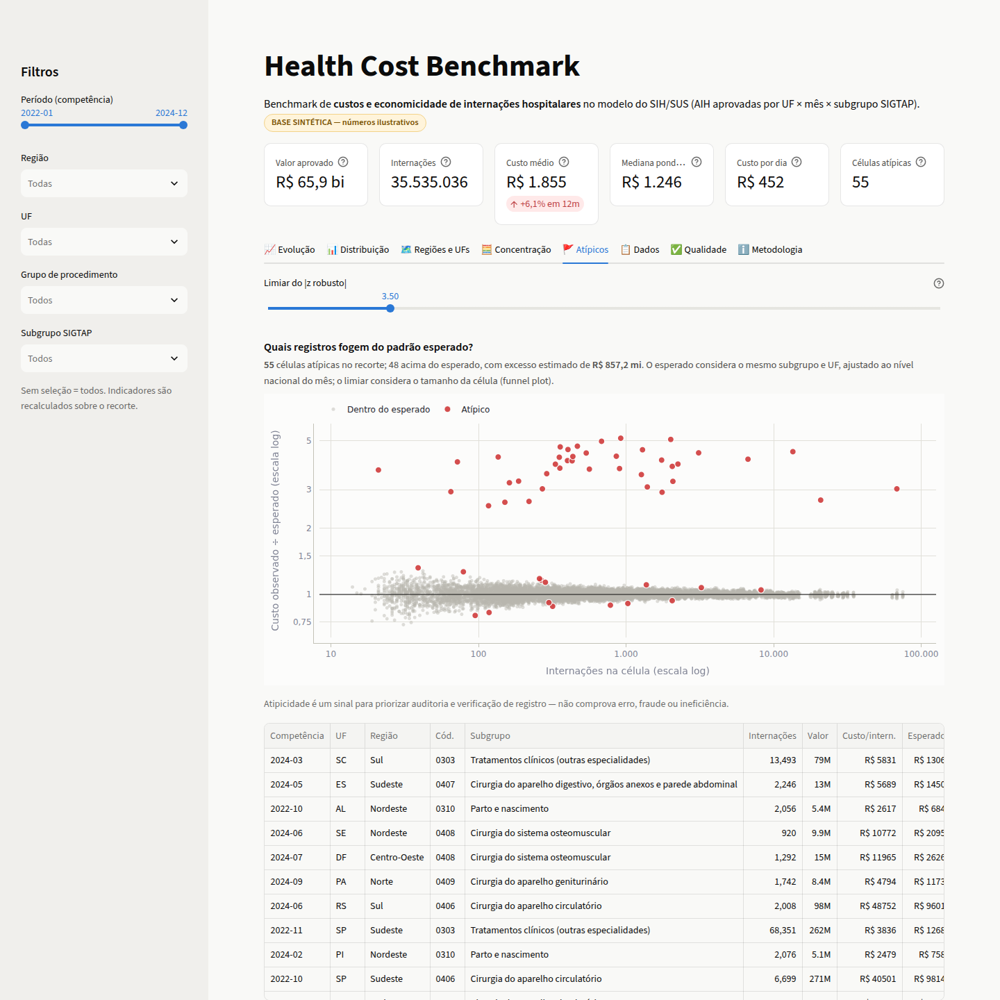

# Health Cost Benchmark

**Benchmark analítico de custos e economicidade de internações hospitalares com dados abertos do SUS.**
Pipeline de dados com validação de qualidade, indicadores com metodologia documentada, análise estatística,
detecção de atípicos e um dashboard interativo.

 
 

> ⚠️ **Os resultados deste repositório foram gerados a partir de uma base SINTÉTICA** que reproduz a
> estrutura do SIH/SUS (DATASUS). Ela permite executar o projeto de ponta a ponta, offline. Os números
> ilustram os métodos e **não descrevem a realidade do SUS**. Para usar dados reais, veja
> [Fonte dos dados](#4-fonte-dos-dados).

🌐 **Página do projeto (GitHub Pages):** https://linemanrj.github.io/health-cost-benchmark/ — resultados com
gráficos interativos, sem instalar nada.



**Em 1 minuto:**

| | |
|---|---|
| **Problema** | Gestores precisam saber onde o gasto hospitalar cresce, onde paga-se mais pelo mesmo tipo de procedimento e quais registros merecem auditoria |
| **Dados** | Produção hospitalar do SUS agregada (AIH aprovadas por mês × UF × subgrupo SIGTAP). Sem dados pessoais |
| **Solução** | Pipeline validado → 15+ indicadores → testes estatísticos → detecção de atípicos → dashboard Streamlit |
| **Diferenciais** | Índice de custo ajustado ao mix · atípicos com modelo de funnel plot (100% de recall na base de teste) · quarentena de dados inválidos · ferramentas prontas para agente de IA |
| **Executar** | `pip install -r requirements.txt && pip install -e . && python -m hcb.pipeline && streamlit run dashboard/app.py` |

---

## Sumário
1. [Problema](#1-problema) · 2. [Objetivo](#2-objetivo) · 3. [Contexto](#3-contexto) ·
4. [Fonte dos dados](#4-fonte-dos-dados) · 5. [Arquitetura](#5-arquitetura) · 6. [Pipeline](#6-pipeline) ·
7. [Metodologia](#7-metodologia) · 8. [Indicadores](#8-indicadores) · 9. [Tecnologias](#9-tecnologias-utilizadas) ·
10. [Como executar](#10-como-executar) · 11. [Exemplos de resultados](#11-exemplos-de-resultados) ·
12. [Limitações](#12-limitações) · 13. [Próximos passos](#13-próximos-passos) · [Future improvements](#future-improvements) ·
[Estrutura do repositório](#estrutura-do-repositório)

---

## 1. Problema

O SUS gasta dezenas de bilhões de reais por ano com internações hospitalares. Olhar só o "custo médio" gera
conclusões erradas:

- uma UF parece "cara" apenas porque realiza **procedimentos mais complexos** (efeito mix);
- médias simples de UFs dão o mesmo peso a Roraima e a São Paulo;
- um único registro com erro de faturamento **distorce a série mensal** de uma região inteira;
- dados com problemas de qualidade (duplicatas, valores negativos, códigos inválidos) contaminam
  indicadores silenciosamente.

## 2. Objetivo

Construir uma solução **demonstrável, reprodutível e auditável** que responda, com metodologia explícita:

1. Como os custos evoluem ao longo do tempo?
2. Quais categorias apresentam maior variação?
3. Existem valores atípicos?
4. Existem diferenças relevantes entre regiões, **depois de ajustar pelo mix de procedimentos**?
5. Quais grupos concentram o maior volume financeiro?

## 3. Contexto

A **economicidade** (princípio do art. 70 da Constituição) pede que o gasto público obtenha o resultado
pretendido ao menor custo compatível com a qualidade. Em saúde, a comparação justa exige controlar **o que**
está sendo produzido. Por isso o projeto trabalha sempre *dentro* do subgrupo de procedimento e usa
**padronização indireta** para comparar UFs e regiões.

O público-alvo inclui áreas de planejamento e orçamento, controle interno e auditoria, regulação e
pesquisadores de economia da saúde.

## 4. Fonte dos dados

| | Base de referência (real) | Base usada neste repositório |
|---|---|---|
| **Fonte** | SIH/SUS: Sistema de Informações Hospitalares (Ministério da Saúde/DATASUS), via TabNet | **Sintética**, gerada por `src/hcb/ingestion/synthetic.py` |
| **Período** | Mensal, desde 2008 | 2022-01 a 2024-12 (36 meses) |
| **Granularidade** | Configurável no TabNet | Competência × UF (27) × subgrupo SIGTAP (16), com ~15 mil linhas |
| **Medidas** | AIH aprovadas, valor aprovado, dias de permanência | As mesmas |
| **Licença/uso** | Dados públicos (LAI, Lei 12.527/2011; Decreto 8.777/2016). Cite a fonte | Livre (MIT) |
| **Dados pessoais** | Não, quando agregados | Não |

A base sintética segue as ordens de grandeza do SIH/SUS: volume proporcional à população (Censo 2022),
diferenças regionais, reajuste de ~6% ao ano e sazonalidade. Ela também contém **problemas de qualidade e 40
anomalias injetadas com gabarito**, o que permite medir o desempenho do pipeline. O acesso automatizado ao
DATASUS é instável e frequentemente bloqueado em ambientes de CI; por isso a base sintética é o padrão. O
adaptador para exportações reais do TabNet já está implementado e testado (`src/hcb/ingestion/tabnet.py`).

📄 Detalhes: [fontes, licença e limitações](docs/data_sources.md) ·
[dicionário de dados](docs/data_dictionary.md)

## 5. Arquitetura



Todas as interfaces (dashboard, notebooks, relatórios e ferramentas de IA) usam **as mesmas funções
testadas** de `src/hcb`. Não existe cálculo duplicado na camada de apresentação.

📄 [Documentação da arquitetura](docs/architecture.md)

## 6. Pipeline

| Etapa | O que faz | Módulo |
|---|---|---|
| **1. Ingestão** | Gera a base sintética ou lê o CSV-contrato. Verifica o esquema | `ingestion/loader.py` |
| **2. Tratamento** | Normaliza competência (`2023/1` → `2023-01`), UF (` sp ` → `SP`), código SIGTAP (`310` → `0310`) e números (`1.234,56`). Remove duplicatas exatas | `processing/cleaning.py` |
| **3. Validação** | 10 regras de **erro** (a linha vai para quarentena com o motivo) e 3 de **alerta**. Checks de conjunto: proporção rejeitada ≤ 5%, período mínimo, lacunas de meses e cobertura de UFs. **Falha explícita** se um check bloqueante não passar | `processing/validation.py` |
| **4. Transformação** | Junta região, população, grupo SIGTAP e calcula custo por internação, por dia e permanência | `processing/transform.py` |
| **5. Indicadores** | KPIs, séries, agregados, índice ajustado ao mix, taxa de utilização, concentração | `analysis/indicators.py` |
| **6. Análise** | Tendência, variação entre UFs, Kruskal–Wallis, Spearman e atípicos | `analysis/statistics.py`, `analysis/outliers.py` |
| **7. Visualização** | Dashboard, notebooks executados, figuras e relatórios Markdown | `dashboard/`, `notebooks/`, `reports/` |

**Qualidade na base sintética:** 15 duplicatas removidas e 20 linhas em quarentena (8 valores nulos, 5
negativos, 4 com quantidade zero e 3 UFs inválidas). É **100% dos problemas injetados**.
→ [relatório de qualidade](reports/quality_report.md)

## 7. Metodologia

- **Médias sempre ponderadas** (Σ valor ÷ Σ internações), nunca média de médias.
- **Comparações dentro do subgrupo SIGTAP**, porque os custos variam em ordens de grandeza entre subgrupos
  (parto ≈ R$ 800; transplante ≈ R$ 35 mil).
- **Índice de custo ajustado ao mix (padronização indireta):** observado ÷ esperado, sendo o esperado o que a
  UF gastaria pagando o custo médio nacional de cada subgrupo no mesmo mês.
- **Tendência:** Theil–Sen sobre o log do custo (robusto a picos), anualizado com IC 95%, mais Mann–Kendall.
- **Diferenças regionais:** Kruskal–Wallis por subgrupo com a **UF como unidade** (evita pseudo-replicação),
  tamanho de efeito ε² e correção de Holm.
- **Atípicos:** resíduo em log contra o esperado (subgrupo × UF, ajustado ao mês), padronizado por um modelo
  de variância `a/n + b`, como nos *funnel plots* com sobredispersão. abs(z) > 3,5 é o limiar.
- **Correlação ≠ causalidade:** diferenças e associações são descritivas e podem refletir gravidade, rede,
  fluxo de pacientes ou registro.

📄 [Metodologia completa, com fórmulas e referências](docs/methodology.md)

## 8. Indicadores

| Indicador | Definição | Pergunta que responde |
|---|---|---|
| Valor total | Σ valor aprovado | Quanto se gasta? |
| Internações | Σ AIH aprovadas | Quanto se produz? |
| Custo médio por internação | Σ valor ÷ Σ internações | Quanto custa, em média, uma internação? |
| Mediana (células) e mediana ponderada | Percentil 50 do custo por internação | Qual o custo "típico", sem influência de extremos? |
| Custo por dia de permanência | Σ valor ÷ Σ dias | O custo vem da diária ou do tempo internado? |
| Permanência média | Σ dias ÷ Σ internações | Uso de leito |
| Variação em 12 meses / a/a mensal | Janela atual ÷ anterior − 1 | O custo está acelerando? |
| Crescimento anual (Theil–Sen) | exp(12 × inclinação) − 1 | Qual a tendência estrutural? |
| CV entre UFs e razão P90/P10 | Dispersão do custo das UFs no subgrupo | Quais categorias variam mais? |
| Índice ajustado ao mix (ICAM) | Observado ÷ esperado | Quem paga mais pelo mesmo mix? |
| Internações por 10 mil hab./mês | Σ N ÷ (pop × meses) | Qual o nível de utilização? |
| Participação, Pareto, HHI | Share, acumulado e Σ share² | Onde o gasto se concentra? |
| z robusto e excesso estimado | Ver metodologia | Quais registros investigar primeiro? |

## 9. Tecnologias utilizadas

| Camada | Tecnologia |
|---|---|
| Linguagem | Python 3.10+ |
| Dados e estatística | pandas, NumPy, SciPy |
| Visualização | Plotly (dashboard), Matplotlib (figuras estáticas) |
| Dashboard | Streamlit |
| Configuração | YAML (`config/settings.yaml`) |
| Qualidade | pytest (52 testes), ruff, GitHub Actions (Python 3.10 e 3.12) |
| Notebooks | Jupyter (gerados e executados por script) |

## 10. Como executar

**Pré-requisitos:** Python 3.10 ou superior e git.

```bash
git clone https://github.com/linemanrj/health-cost-benchmark.git
cd health-cost-benchmark

python -m venv .venv
source .venv/bin/activate            # Windows: .venv\Scripts\activate

pip install -r requirements.txt
pip install -e . --no-deps           # instala o pacote hcb (src/)

python -m hcb.pipeline               # gera a base sintética e roda o pipeline (~2 s)
streamlit run dashboard/app.py       # abre http://localhost:8501
```

O dashboard também roda o pipeline sozinho na primeira abertura, se as saídas não existirem.

**Desenvolvimento:**

```bash
pip install -r requirements-dev.txt
pytest                               # 52 testes
ruff check .                         # lint
python scripts/make_figures.py       # figuras do README
python scripts/build_notebooks.py    # regera e executa os notebooks
python scripts/build_site.py         # gera o site estático em site/ (GitHub Pages)
```

**GitHub Pages:** o workflow `.github/workflows/pages.yml` executa o pipeline, gera o site com
`scripts/build_site.py` (mesmos cálculos e gráficos do dashboard, em HTML estático com Plotly) e publica a
cada push na `main`. Para ativar: *Settings → Pages → Build and deployment → Source: GitHub Actions*.

Com `make`: `make install`, `make pipeline`, `make dashboard`, `make test`, `make lint` e `make all`.

**Configuração** (`config/settings.yaml`): fonte de dados (`synthetic` ou `contract_csv`), período e semente
da base sintética, limite de rejeição, limiar de atipicidade e nível de significância. Nenhuma credencial é
necessária.

## 11. Exemplos de resultados

> Base sintética: números ilustrativos. Relatório completo gerado pelo pipeline em
> [`reports/analysis_summary.md`](reports/analysis_summary.md).

**Visão geral (2022–2024):** R$ 65,9 bi em 35,5 milhões de internações. Custo médio de R$ 1.854,73 e
mediana ponderada de R$ 1.246,10 (a média é puxada por subgrupos de alto custo). Custo médio +6,1% nos
últimos 12 meses.

**Como os custos evoluem?** Todas as regiões mostram tendência de alta de 6,1% a 6,4% ao ano (Theil–Sen, p
ajustado < 0,001). Os picos isolados do Sudeste e do Sul **não são tendência**: são células atípicas de alto
volume, que o módulo de atípicos identifica.



**Quem paga mais pelo mesmo mix?** Depois do ajuste de mix, Sudeste (1,067) e Sul (1,065) ficam ~6,5% acima
do esperado, e Nordeste (0,882) e Norte (0,910) abaixo. Kruskal–Wallis indica diferença regional
significativa em 4 de 16 subgrupos, com efeitos grandes (ε² ≈ 0,7). Isso é associação: não controla a
gravidade dos casos.



**Quais categorias variam mais?** Cirurgia do aparelho circulatório (CV entre UFs de 12,1%; P90/P10 = 1,38),
lesões por causas externas (11,9%) e cirurgia osteomuscular (11,6%).

**Existem valores atípicos?** 55 células sinalizadas: 48 acima do esperado, com excesso estimado de R$ 857
mi. Contra o gabarito sintético, o método tem **recall de 100% e precisão de 73%**; com limiar 4,0, a
precisão sobe para 91%.



**Onde o gasto se concentra?** 8 de 16 subgrupos somam 80% do valor (HHI = 1.133, baixa concentração).
Tratamentos clínicos (21,5%) e cirurgia do aparelho circulatório (15,9%) lideram. O primeiro lidera por
volume, o segundo por custo unitário.



**Dashboard — aba de atípicos:** filtros por período, região, UF, grupo e subgrupo, com limiar ajustável e
tabela exportável.



| Aba do dashboard | Pergunta analítica |
|---|---|
| 📈 Evolução | Como o custo evolui? Está acelerando? A tendência é consistente por região? |
| 📊 Distribuição | Como o custo se distribui em cada subgrupo? Quais variam mais entre UFs? |
| 🗺️ Regiões e UFs | Quem gasta acima do esperado para o seu mix? As diferenças são significativas? Volume se associa a custo? |
| 🧮 Concentração | Quais subgrupos concentram o gasto, e por volume ou por custo unitário? |
| 🚩 Atípicos | Quais registros fogem do esperado e quanto representam? |
| 📋 Dados | Tabela detalhada do recorte, com download em CSV |
| ✅ Qualidade | Os dados são confiáveis? O que foi rejeitado e por quê? |
| ℹ️ Metodologia | Definição de cada indicador e limites de interpretação |

## 12. Limitações

- **Base sintética:** os resultados publicados não descrevem o SUS. Servem para demonstrar e validar o método.
- **Valor aprovado ≠ custo econômico:** o SIH reflete a remuneração pela Tabela SUS, não o custo real do
  hospital nem complementações estaduais e municipais.
- **Apenas SUS**, sem saúde suplementar.
- **Local de internação:** UFs de referência atendem pacientes de outras UFs.
- **Valores nominais:** o crescimento inclui inflação e reajustes de tabela.
- **O ajuste de mix é parcial:** controla o subgrupo SIGTAP, mas não idade, gravidade nem comorbidades.
- **Testes estatísticos:** Mann–Kendall não corrige autocorrelação, e Kruskal–Wallis com ≤ 27 UFs tem baixo
  poder para efeitos pequenos.
- **Atípicos são sinais para investigação**, não prova de erro, fraude ou ineficiência.

## 13. Próximos passos

1. Carregar dados reais do TabNet para 2–3 subgrupos e publicar a comparação com a base sintética.
2. Deflacionar valores (IPCA) e decompor a variação do gasto em **volume × preço × mix**.
3. Ajuste por perfil etário e sexo (padronização direta) com microdados agregados.
4. Armazenamento em Parquet/DuckDB e ingestão agendada.
5. Deploy do dashboard (Streamlit Community Cloud).

## Future improvements

A base para cada evolução já está no código. Detalhes em [`docs/future_improvements.md`](docs/future_improvements.md).

| Evolução | Já preparado | Próximo passo |
|---|---|---|
| **Previsão de custos** | `hcb/forecasting.py`: baseline sazonal com deriva e `backtest()` (MAPE fora da amostra) | ETS/SARIMA/gradient boosting por subgrupo e região; adotar só se superar o baseline |
| **Anomalias com Machine Learning** | Escore robusto e **gabarito sintético** para medir precisão e recall | Isolation Forest/LOF multivariado, change-point detection, explicabilidade por alerta |
| **Análise conversacional** | `hcb/ai/tools.py`: ferramentas determinísticas com JSON Schema (`TOOL_SPECS`) e despachante validado | Aba "Pergunte aos dados" com LLM + *tool use*; o modelo nunca calcula números, só chama ferramentas |
| **Agente de IA** | Ferramentas somente leitura, filtros em lista de permitidos e testes | Agente multi-etapas com guardrails, log de chamadas e *eval* com respostas de referência |

## Estrutura do repositório

```
health-cost-benchmark/
├── README.md
├── LICENSE                     # MIT
├── pyproject.toml              # pacote, pytest e ruff
├── requirements.txt / requirements-dev.txt
├── Makefile
├── config/settings.yaml        # fonte, limiares e parâmetros
├── data/
│   ├── reference/              # UFs (IBGE) e subgrupos SIGTAP
│   ├── sample/                 # amostras da base sintética
│   ├── raw/ processed/ external/   # gerados (não versionados)
│   └── README.md
├── src/hcb/
│   ├── ingestion/              # sintético, TabNet, loader
│   ├── processing/             # tratamento, validação, transformação
│   ├── analysis/               # indicadores, estatística, atípicos
│   ├── ai/tools.py             # ferramentas para agente de IA
│   ├── forecasting.py          # baseline de previsão
│   ├── reporting.py            # resumo analítico
│   └── pipeline.py             # orquestração (CLI)
├── dashboard/                  # app Streamlit + gráficos Plotly
├── notebooks/                  # 01 exploratória · 02 estatística · 03 atípicos
├── scripts/                    # geração de dados, figuras, notebooks, site (Pages)
├── tests/                      # 52 testes unitários e de integração
├── reports/                    # relatório de qualidade e resumo analítico
├── docs/                       # arquitetura, fontes, dicionário, metodologia, evolução
└── .github/workflows/          # ci.yml (lint + testes + pipeline) · pages.yml (deploy do site)
```

---

Código sob licença [MIT](LICENSE). Dados reais, quando usados, pertencem ao Ministério da Saúde/DATASUS e
devem ser citados conforme [docs/data_sources.md](docs/data_sources.md).
