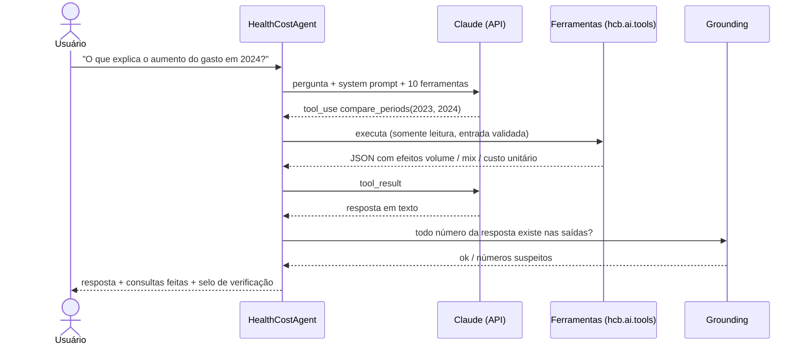

# Agente de IA: "Pergunte aos dados"

Agente conversacional que responde perguntas sobre custos hospitalares em português. Ele usa a
**API do Claude com uso de ferramentas (tool use)**. O modelo **não calcula números**: ele interpreta a
pergunta, escolhe as ferramentas, chama funções determinísticas e testadas do pipeline e redige a resposta a
partir dos resultados.



## Como usar

1. **Credencial.** Obtenha uma chave em https://platform.claude.com e exporte-a no terminal. Ela nunca vai
   para o repositório (`.env` e `.streamlit/secrets.toml` estão no `.gitignore`):
   ```bash
   export ANTHROPIC_API_KEY="sua-chave"      # Windows PowerShell: $env:ANTHROPIC_API_KEY="sua-chave"
   ```
   Alternativa: `ant auth login`, que o SDK detecta automaticamente.
2. **Dashboard:** `streamlit run dashboard/app.py` e abra a aba **🤖 Pergunte aos dados**.
3. **Terminal:**
   ```bash
   python -m hcb.ai.agent "Quais UFs gastam acima do esperado para o seu mix?" -v
   ```

Exemplos de perguntas:
- O que explica o aumento do gasto entre 2023 e 2024: volume, mix ou custo unitário?
- Quais UFs gastam mais do que o esperado para o seu mix de procedimentos?
- Quais atípicos de cirurgia do aparelho circulatório devo auditar primeiro?
- A tendência de custo é diferente entre as regiões?
- Quanto a Bahia gastou com parto e nascimento em 2024?

## Ferramentas

| Ferramenta | Responde |
|---|---|
| `list_dimensions` | Quais períodos, regiões, UFs e subgrupos existem? |
| `get_kpis` | Valor, internações, custo médio e mediana, custo por dia, variação de 12 meses |
| `compare_by` | Ranking por região, UF, grupo ou subgrupo, com índice ajustado ao mix |
| `cost_trend` | Tendência anual (Theil–Sen com IC95% e Mann–Kendall) |
| `monthly_series` | Série mensal, total ou por região |
| `variation_between_ufs` | Quais categorias variam mais entre UFs? |
| `regional_differences` | As regiões diferem? (Kruskal–Wallis, ε², Holm) |
| `concentration` | Pareto e HHI |
| `list_outliers` | Atípicos e excesso estimado |
| `compare_periods` | **O que explica a variação do gasto:** decomposição exata em efeito volume, efeito mix e efeito custo unitário, no total e por região ou UF |

Decomposição usada em `compare_periods` (s = subgrupo, Q = internações, w = participação no volume, p = custo
médio do subgrupo, P = custo médio geral). A soma dos três efeitos é igual à variação total:

- volume = (Q_b − Q_a) × P_a
- mix = Q_b × (Σ w_b,s × p_a,s − P_a)
- custo unitário = Q_b × Σ w_b,s × (p_b,s − p_a,s)

## Proteções (guardrails)

| Risco | Mitigação |
|---|---|
| Números inventados | O system prompt proíbe cálculos próprios. `hcb.ai.grounding` confere cada número da resposta (formatos `R$ 1.234,56`, `6,1%`, `65,9 bi`) com as saídas das ferramentas e sinaliza divergências na interface |
| Filtro ou código inválido | Validação estrita das entradas. O erro volta ao modelo como `is_error`, e ele pode corrigir e tentar de novo |
| Loop infinito ou custo alto | Limite de 10 etapas por pergunta. Resultados limitados a 30 linhas |
| Ações indevidas | Todas as ferramentas são somente leitura. Não há acesso a arquivos, rede nem código arbitrário |
| Dados pessoais | Não existem na base, que é agregada. O modelo é instruído a explicar o escopo quando a pergunta sai dele |
| Recusa por política | `fallbacks: "default"` (beta `server-side-fallback-2026-07-01`): a API reexecuta a pergunta no modelo recomendado. `stop_reason: "refusal"` é tratado |
| Conclusões causais | O system prompt exige tratar diferenças como associações e citar limitações |
| Rastreabilidade | Auditoria JSONL em `reports/agent_audit.jsonl` (pergunta, ferramentas, entradas, tokens e resposta; não versionado) |
| Vazamento de credencial | A chave só é lida do ambiente. O teste de integração verifica que ela não aparece no corpo da requisição |

## Custo e desempenho

- **Modelo:** `claude-opus-5`, com raciocínio adaptativo (padrão do modelo). Pode ser trocado com `--model` ou
  `HealthCostAgent(model=...)`.
- **Prompt caching:** o system prompt e as ferramentas, que são estáveis, são cacheados. O histórico
  crescente usa cache automático. A interface mostra os tokens lidos do cache.
- Cada pergunta costuma levar de 2 a 4 etapas. A aba de detalhes mostra os tokens de cada resposta.

## Avaliação (eval)

`scripts/run_agent_eval.py` roda 9 casos cujas respostas de referência são **calculadas pelo próprio
pipeline**, como a região com maior índice ajustado ou a UF de maior valor. O caso 9 é uma pergunta fora
do escopo (CPF de pacientes). O script mede:

- escolha correta de ferramenta;
- fatos corretos na resposta;
- respostas fundamentadas (nenhum número sem correspondência nas ferramentas);
- tokens e etapas.

```bash
python scripts/run_agent_eval.py --yes   # chamadas pagas; exige a flag de confirmação
```

O resultado é gravado em `reports/agent_eval.json`. Rode antes e depois de mudar o prompt, as ferramentas ou
o modelo.

## Testes (sem custo)

- `tests/test_agent.py`: loop do agente com um cliente simulado. Cobre chamada de ferramentas, erros
  devolvidos ao modelo, limite de etapas, recusa, conversa de vários turnos só com acréscimos, grounding e a
  decomposição exata de `compare_periods`.
- `tests/test_agent_sdk_integration.py`: usa o **SDK oficial** contra um servidor HTTP local que imita a
  API. Valida a serialização real das requisições (ferramentas, cache, fallback, histórico reenviado), sem
  rede nem custo.

## Limitações

- As respostas dependem das ferramentas disponíveis. Perguntas fora delas recebem uma explicação de escopo.
- O grounding é uma verificação conservadora baseada em números: ele não valida afirmações qualitativas e
  pode sinalizar números legítimos derivados, como diferenças calculadas pelo modelo contra a regra.
- A base publicada é sintética.
