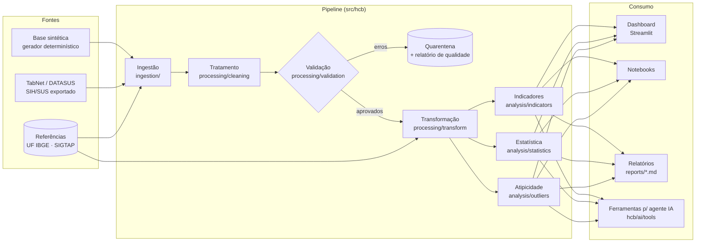

# Arquitetura

## Visão geral

O projeto é organizado em camadas com responsabilidades separadas. Cada etapa do pipeline é uma função
pura, testável e reutilizada pelo dashboard, notebooks e ferramentas de IA. Assim, os números exibidos em
qualquer interface vêm do mesmo código testado.



Versão em texto (para leitores sem suporte a Mermaid):

```
 Dados brutos ─► Tratamento ─► Validação ─┬─► Transformação ─► Indicadores ─► Análise ─► Visualização
 (sintético ou    (tipos,       (13 regras │   (referências,     (KPIs,         (tendência,  (Streamlit,
  TabNet)          formatos,     + checks  │    métricas          séries,        Kruskal,     notebooks,
                   duplicatas)   de        │    derivadas)        mix, Pareto)   atípicos)    relatórios)
                                 conjunto) └─► Quarentena + relatório de qualidade
```

## Componentes

| Camada | Módulo | Responsabilidade |
|---|---|---|
| Configuração | `config/settings.yaml`, `hcb/config.py` | Caminhos, fonte de dados, limiares de qualidade e de atipicidade; validação das chaves |
| Contrato | `hcb/schema.py` | Colunas do formato canônico e das colunas derivadas |
| Ingestão | `hcb/ingestion/` | `synthetic.py` (gerador com gabarito), `tabnet.py` (parser de exportações do TabNet), `loader.py` (seleção da fonte) |
| Tratamento | `hcb/processing/cleaning.py` | Normaliza competência, UF, código SIGTAP e números (formatos BR e US); remove duplicatas exatas |
| Validação | `hcb/processing/validation.py` | Regras por linha (erro → quarentena; alerta → mantém) e checks de conjunto (bloqueantes) |
| Transformação | `hcb/processing/transform.py` | Junta referências (região, grupo SIGTAP, população) e calcula métricas por célula |
| Indicadores | `hcb/analysis/indicators.py` | KPIs, séries mensais, agregações, taxa de utilização, índice ajustado ao mix, concentração |
| Estatística | `hcb/analysis/statistics.py` | Tendência (Theil–Sen/Mann–Kendall), variação entre UFs, Kruskal–Wallis, Spearman, Holm |
| Atipicidade | `hcb/analysis/outliers.py` | Escore robusto contextual com variância a/n + b (funnel plot) e cercas de Tukey |
| Relatórios | `hcb/reporting.py` | Resumo analítico em Markdown respondendo às perguntas de negócio |
| Orquestração | `hcb/pipeline.py` | Executa as etapas, grava saídas e trata erros com código de saída ≠ 0 |
| Apresentação | `dashboard/` | Streamlit + Plotly, filtros e indicadores recalculados sobre o recorte |
| Agente de IA | `hcb/ai/agent.py`, `tools.py`, `grounding.py` | Loop de *tool use* com a API do Claude, 10 ferramentas somente leitura e verificação numérica das respostas ([ai_agent.md](ai_agent.md)) |
| Evolução | `hcb/forecasting.py` | Baseline de previsão |

## Decisões de projeto

- **Dados agregados, sem dados pessoais.** O contrato é competência × UF × subgrupo. Não há paciente,
  profissional nem estabelecimento, o que elimina risco de reidentificação e alinha o projeto à LGPD.
- **Quarentena em vez de correção silenciosa.** A limpeza só padroniza formatos. Valores inválidos nunca são
  imputados: a linha é isolada em `data/processed/quarentena.csv` com o motivo.
- **Falha explícita.** Se a proporção de linhas rejeitadas ou a cobertura temporal ficarem fora dos limites
  configurados, o pipeline para (`DataQualityError`) em vez de produzir indicadores enganosos.
- **Uma fonte de verdade para cálculos.** Dashboard, notebooks, relatórios e ferramentas de IA importam as
  mesmas funções. Nenhuma lógica de indicador é duplicada na interface.
- **Arquivos CSV como armazenamento.** Mantém o projeto leve e legível. A troca por Parquet ou DuckDB é
  local ao pipeline (ver `docs/future_improvements.md`).
- **Reprodutibilidade.** A base sintética é determinística (semente em `settings.yaml`), e os notebooks são
  gerados e executados a partir de `scripts/build_notebooks.py`.

## Saídas

| Caminho | Conteúdo |
|---|---|
| `data/processed/fato_internacoes.csv` | Tabela fato validada e enriquecida |
| `data/processed/fato_internacoes_com_atipicidade.csv` | Tabela fato + resíduo, z robusto, custo esperado |
| `data/processed/quarentena.csv` | Linhas rejeitadas com motivo |
| `data/processed/indicadores/*.csv, kpis.json` | Indicadores e resultados estatísticos |
| `reports/quality_report.{json,md}` | Relatório de qualidade dos dados |
| `reports/analysis_summary.md` | Resumo analítico (respostas às perguntas de negócio) |
